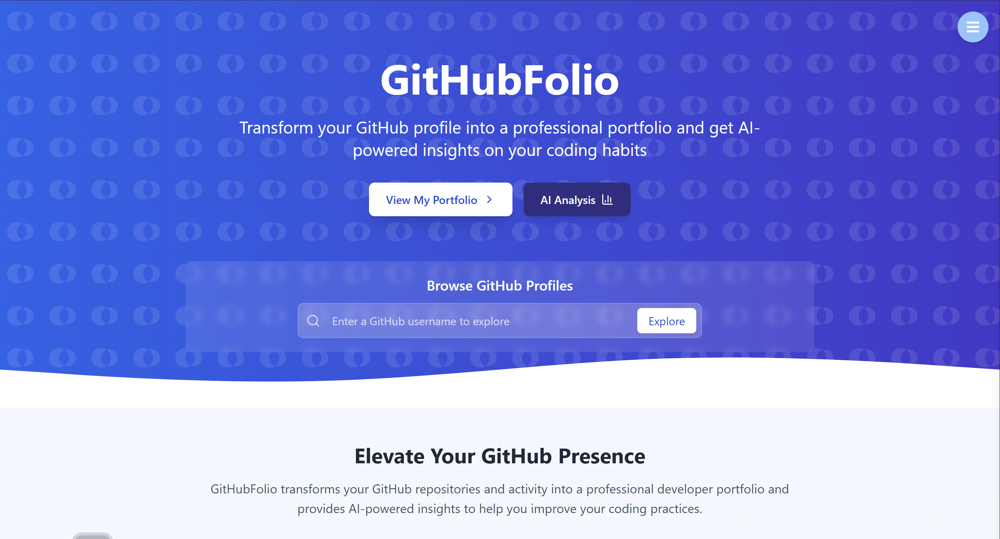
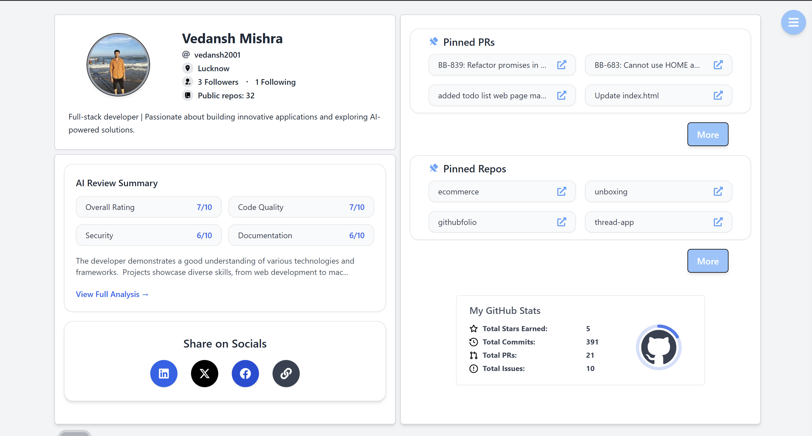
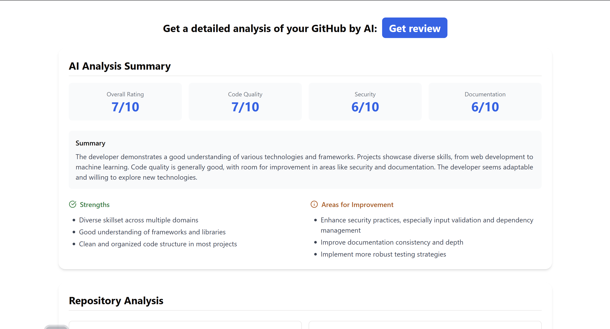

# GithubFolio.in

[](https://github.com/vedansh2001/githubfolio)

A GitHub portfolio website with AI-based reviews of your GitHub profile.

## 📖 Overview

GithubFolio.in creates personalized portfolio websites from your GitHub profile and offers AI-powered analysis of your repositories. The application fetches your GitHub data and provides comprehensive insights about your code quality, security practices, documentation, and more.

## ✨ Features

- **GitHub Integration**: Automatically pulls your repository data, bio, followers, and location
- **AI-Powered Analysis**: Uses Gemini 1.5 Pro to analyze your top repositories
- **Comprehensive Reports**: Provides detailed ratings and feedback on:
  - Overall code quality
  - Security practices
  - Documentation quality
  - Individual repository analysis

## 🔧 Tech Stack

- **Frontend & Backend**: Next.js
- **Database**: PostgreSQL with Prisma ORM
- **Authentication**: Next-Auth
- **Deployment**: AWS EC2
- **AI Integration**: Gemini 1.5 Pro API
- **API Layer**: FastAPI

## 🚀 How It Works

1. Sign up and authenticate with your GitHub account
2. Provide your GitHub username
3. The application fetches basic profile information:
   - Number of repositories
   - GitHub bio
   - Follower/following counts
   - Location
4. When you request an AI analysis:
   - Your top 10 repositories are identified based on metrics like commits and stars
   - Files from these repositories are combined
   - The consolidated file is sent to Gemini 1.5 Pro API
   - The API returns a detailed analysis based on predefined criteria

## 📊 Analysis Report

The AI analysis includes:
- Overall rating
- Code security rating
- Code quality rating
- Documentation rating
- Summary of strengths and areas for improvement
- Individual analysis for each analyzed repository

## 📸 Screenshots


*Caption: GithubFolio homepage*


*Caption: GithubFolio dashboard showing user profile and repository analytics*


*Caption: Example of AI-generated repository analysis*

## 🔐 Authentication

The application uses Next-Auth for secure GitHub authentication, ensuring that users can only access their own portfolio and analysis data.

## 🛠️ Installation & Setup

```bash
# Clone the repository
git clone https://github.com/vedansh2001/githubfolio.git

# Navigate to project directory
cd githubfolio

# Install dependencies
npm install

# Set up environment variables
cp .env.example .env.local
# Edit .env.local with your credentials

# Set up the database
npx prisma migrate dev

# Run the development server
npm run dev

# move to ai-analysis directory
cd ai-analysis

#Create Virtual Environment
python3 -m venv venv

#Activate Virtual Environment
venv\Scripts\activate

#Install Requirements
pip install -r requirements.txt

#Run the App
./start.sh

```
